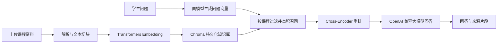

# AI Coach

AI Coach 是面向学生的个性化异步学习平台 MVP。它围绕“课程资料 -> 检索问答 -> 测验练习 -> 错题复盘 -> 学习诊断与画像 -> 学习计划”建立学习闭环，把课程专属资料和真实学习记录用于后续回答与建议。

当前版本适合课程设计、毕业设计原型、个人使用和小范围演示，不以高并发生产部署为目标。

## 核心功能

- 用户注册、登录、课程创建、编辑和删除
- PDF、PPT/PPTX、DOCX 资料上传与批量导入；支持网页和视频资料入口
- PDF 可选 PyMuPDF 快速解析或 Docling 结构化解析；DOCX 使用 python-docx，演示文稿使用 Docling
- 基于课程资料的 RAG 问答，保留会话、历史记录和检索来源
- 从课程资料生成知识点和测验，支持作答、参考答案、AI 判题和解析
- 错题库：作答错题、手动录入、问答加入错题、图片分析与复盘状态
- 学习诊断与学习画像：综合作答成绩、错题复盘、学习打卡、学习时长、提问和学习建议；样本不足时显示“待采样”而不是错误地显示为 0%
- 整体学习计划、每日学习计划、学习反馈和计划更新
- 通过 OpenAI 兼容接口接入不同的对话大模型

## RAG 流程



- Embedding：默认 `BAAI/bge-small-zh-v1.5`，由 Transformers 在本机生成归一化向量。
- 向量库：Chroma `PersistentClient`，默认目录为 `backend/chroma_db`，使用 inner-product 空间。
- 召回：在同一课程范围内获取候选片段，并用点积重新排序，默认候选数为 30。
- 重排：默认 `cross-encoder/mmarco-mMiniLMv2-L12-H384-v1`，保留前 5 个片段。
- 生成：通过 OpenAI SDK 调用兼容 Chat Completions 的服务，可配置 DeepSeek、OpenAI、通义千问、硅基流动或其他兼容服务。

“OpenAI 兼容”只代表接口格式兼容，不代表模型必须来自 OpenAI。修改 `AI_BASE_URL`、`AI_API_KEY` 和 `AI_MODEL` 即可切换服务商，无需改业务代码。

## 技术栈

| 层级 | 技术 | 用途 |
| --- | --- | --- |
| 前端 | React 19、TypeScript、Vite、Tailwind CSS | 课程学习、上传、问答、测验、错题和画像界面 |
| 前端辅助 | Axios、React Router、React Markdown、KaTeX、Lucide React | 接口调用、导航、Markdown/公式渲染和图标 |
| 后端 | Python、FastAPI、Uvicorn、Pydantic Settings | REST API、配置和业务编排 |
| 数据 | SQLAlchemy、PyMySQL、MariaDB/MySQL | 课程、资料、题目、对话、错题和学习记录 |
| 知识库 | Chroma | 课程片段与 Embedding 的本地持久化检索 |
| 本地模型 | Transformers、PyTorch | Embedding、点积召回后的交叉编码器重排，可使用 CUDA |
| 资料处理 | PyMuPDF、Docling、python-docx、yt-dlp | PDF、演示文稿、Word 和视频资料处理 |
| 图片备用能力 | PaddleOCR、pytesseract、Pillow | 错题图片 OCR 兜底；优先使用配置的视觉模型 |

## 目录结构

```text
.
├── backend/
│   ├── app/
│   │   ├── ai_service.py       # OpenAI 兼容模型调用与文本处理
│   │   ├── rag_service.py      # Embedding、Chroma 召回和重排
│   │   ├── database.py         # 数据库与 RAG 配置
│   │   ├── main.py             # FastAPI 接口与业务流程
│   │   └── models.py           # SQLAlchemy 数据模型
│   ├── requirements.txt
│   ├── requirements-gpu.txt
│   ├── start_backend.ps1
│   └── start_database.ps1
├── 前端/
│   ├── src/
│   ├── package.json
│   └── vite.config.ts
└── README.md
```

## 部署前下载与配置

部署机器需要能够访问数据库、所选大模型服务，以及 Hugging Face 模型下载源。首次导入资料或提问时，Embedding 和重排模型会自动下载；建议在上线前预热一次，避免首次用户请求等待下载。

### 必需环境

1. 安装 Node.js 20 或更高版本，并安装 pnpm。
2. 安装 Python 3.11 或与项目依赖兼容的版本，并确保可以创建虚拟环境。
3. 安装并启动 MariaDB 或 MySQL，创建项目数据库账号。
4. 准备一个 OpenAI 兼容大模型服务的 API Key；没有 API Key 时，问答、出题和分析功能无法生成内容。
5. 确保服务器可写入 `backend/uploads`、`backend/chroma_db` 和数据库数据目录，并把这些运行数据排除在 Git 之外。

### 后端依赖下载

在后端目录创建虚拟环境并安装依赖：

```powershell
cd backend
python -m venv .venv
.\.venv\Scripts\Activate.ps1
pip install -r requirements.txt
```

这会下载 FastAPI、SQLAlchemy、PyMuPDF、Docling、Chroma、Transformers、PyTorch、PaddleOCR 等 Python 依赖。`Docling`、`PaddleOCR`、`PyTorch` 和 Transformers 模型体积较大，部署时需要预留磁盘空间和网络带宽。

如需 GPU，确认 NVIDIA 驱动和 CUDA 环境与 PyTorch CUDA 轮子匹配后安装：

```powershell
pip install -r requirements-gpu.txt
```

`RAG_DEVICE=auto` 会在检测到 CUDA 时优先使用 GPU；没有可用 GPU 时自动回退到 CPU。

### 本地模型预热

默认会下载以下 Hugging Face 模型：

```text
BAAI/bge-small-zh-v1.5
cross-encoder/mmarco-mMiniLMv2-L12-H384-v1
```

在受限网络环境中，应提前配置可用的 Hugging Face 镜像或把模型缓存带到部署机器。模型首次下载成功后会由 Transformers 缓存；之后服务可复用本地缓存。

### 可选系统组件

- 需要处理错题图片且不使用视觉模型时，安装 Tesseract OCR，并准备中文语言包 `chi_sim`；项目会在 PaddleOCR 不可用时尝试该备用路径。
- 使用视频资料导入时，需要网络可访问对应视频平台及可用字幕；`yt-dlp` 已包含在 Python 依赖中，但部分平台可能受到访问限制。
- 大文件解析、视频导入和 OCR 当前在后端进程内执行。正式生产部署建议增加后台任务队列、资源限制、对象存储与备份策略。

## 配置环境变量

直接登陆网站设置里面配置模型（提供方的接口格式和 OpenAI API 一样）

## 本地启动

### 1. 启动数据库

```powershell
cd backend
powershell -ExecutionPolicy Bypass -File .\start_database.ps1
```

### 2. 启动后端

```powershell
cd backend
powershell -ExecutionPolicy Bypass -File .\start_backend.ps1
```

后端健康检查：`http://127.0.0.1:8000/health`

接口文档：`http://127.0.0.1:8000/docs`

### 3. 启动前端

```powershell
cd 前端
pnpm install
pnpm dev
```

默认地址：`http://127.0.0.1:5173`

## 验证

后端测试：

```powershell
cd backend
pytest -q
```

前端生产构建：

```powershell
cd 前端
pnpm build
```

## 数据与安全说明

以下运行数据和密钥不得提交到 Git：

- `backend/.env`
- `backend/.mysql-data/` 与其他数据库备份目录
- `backend/uploads/`
- `backend/chroma_db/`
- `backend/.venv/`、`backend/.venv-win/`
- `前端/node_modules/`、`前端/dist/`、`前端/.env.local`

当前认证与部署方式仍以演示和本地开发为目标。公开部署前需要补充密码策略、会话或令牌鉴权、权限隔离、HTTPS、日志脱敏、备份与恢复流程。

## 当前限制与后续方向

- 文档和图片处理是同步 MVP 流程，大文件需要等待；可升级为 Redis + Celery/RQ 等后台任务队列。
- 本地向量库、上传文件和数据库需要单独备份；可迁移到对象存储和托管数据库。
- 可继续完善课程资料的页码/段落级引用、用户隔离、计划版本管理、部署脚本和 CI 检查。
