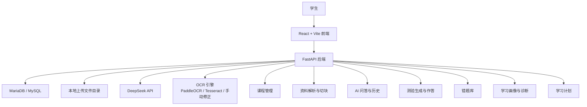
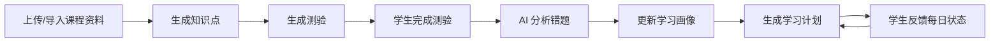

# AI Coach

AI Coach 是一个面向学生的个性化异步学习平台 MVP。项目围绕“课程资料 -> 知识理解 -> 测验检测 -> 错题分析 -> 学习画像 -> 学习计划”的闭环设计，目标是帮助学生把分散资料转化为可持续复习和反馈的学习流程。

## 项目目的

本项目用于验证生成式 AI 在学生自主学习场景中的可行性，重点解决以下问题：

- 学生上传或导入课程资料后，系统可以围绕课程生成知识点、测验和学习建议。
- 学生可以针对课程资料进行 AI 问答，并保留历史对话。
- 学生做题或上传错题图片后，系统可以分析错误原因并加入错题库。
- 系统根据资料、问答、测验、错题和反馈更新学习画像。
- 学生可以通过和 AI 交互生成整体学习计划，并根据每日学习状态更新每日计划。

当前版本是 MVP，适合课程设计、毕业设计原型、小范围演示和功能验证，不是面向大规模生产环境的完整 SaaS。

## 核心功能

- 用户登录/注册
- 课程创建、课程详情和课程删除
- PDF 上传、网页导入、视频资料导入
- 基于课程资料的 AI 问答
- 对话历史记录、新建对话、删除对话、关键词搜索历史对话
- 知识点生成，支持按课程或按单份资料生成
- 测验生成，支持直接显示答案模式和学生作答模式
- 测验作答保存、AI 判题和加入错题本
- 错题库管理，支持手动错题、问答回答加入错题本、错题图片 OCR 后分析
- 学习诊断和知识画像
- 整体学习计划、每日学习计划、学习反馈和计划更新
- DeepSeek API Key 设置

## 技术栈

### 前端

- React
- TypeScript
- Vite
- Tailwind CSS
- Axios
- React Markdown
- KaTeX
- Lucide React

前端目录：

```text
前端/
```

### 后端

- FastAPI
- SQLAlchemy
- PyMySQL
- MariaDB / MySQL 协议
- OpenAI SDK 兼容 DeepSeek API
- PyMuPDF
- yt-dlp
- Pillow / pytesseract

后端目录：

```text
backend/
```

### AI 与 OCR

- 文本生成：DeepSeek `deepseek-chat`
- 错题图片处理：
  - 优先尝试 PaddleOCR
  - 其次尝试 Tesseract OCR
  - OCR 不可用时，前端允许学生手动输入或修正题目文字
- RAG 当前以课程资料切块和文本检索为主，后续可扩展到向量数据库。

## 系统架构



## 学习闭环



## 后端接口分层

AI 功能按任务拆分，避免所有能力都挤在一个聊天接口里：

```text
/api/ai/chat
/api/ai/generate-summary
/api/ai/generate-quiz
/api/ai/analyze-mistake
/api/ai/ocr-mistake-image
/api/ai/analyze-mistake-image
/api/ai/extract-knowledge-points
/api/ai/generate-learning-plan
/api/ai/update-daily-learning-plan
```

## 目录结构

```text
.
├── backend/
│   ├── app/
│   │   ├── ai_service.py
│   │   ├── database.py
│   │   ├── main.py
│   │   └── models.py
│   ├── sql/
│   ├── requirements.txt
│   ├── start_backend.ps1
│   └── start_database.ps1
├── 前端/
│   ├── public/
│   ├── src/
│   │   ├── api/
│   │   ├── App.tsx
│   │   ├── data.ts
│   │   ├── index.css
│   │   └── main.tsx
│   ├── package.json
│   └── vite.config.ts
└── README.md
```

## 本地运行

### 1. 启动数据库

在 Windows PowerShell 中进入后端目录：

```powershell
cd backend
powershell -ExecutionPolicy Bypass -File .\start_database.ps1
```

### 2. 配置环境变量

复制示例配置：

```powershell
Copy-Item .env.example .env
```

根据需要填写：

```env
DATABASE_URL=mysql+pymysql://root@127.0.0.1:3306/ai_learning?charset=utf8mb4
DEEPSEEK_API_KEY=你的_deepseek_api_key
DEEPSEEK_BASE_URL=https://api.deepseek.com
DEEPSEEK_MODEL=deepseek-chat
```

### 3. 启动后端

```powershell
cd backend
powershell -ExecutionPolicy Bypass -File .\start_backend.ps1
```

后端健康检查：

```text
http://127.0.0.1:8000/health
```

接口文档：

```text
http://127.0.0.1:8000/docs
```

### 4. 启动前端

```powershell
cd 前端
pnpm install
pnpm dev
```

默认访问：

```text
http://127.0.0.1:5173
```

如果本机没有 `pnpm`，也可以使用项目已有 Node 环境后改用：

```powershell
npm install
npm run dev
```

## 数据与安全说明

以下内容不应提交到 Git：

- `backend/.env`
- `backend/.mysql-data/`
- `backend/uploads/`
- `backend/.venv/`
- `backend/.venv-win/`
- `前端/node_modules/`
- `前端/dist/`
- `前端/.env.local`

仓库中只保留源码、配置示例和启动脚本。

## 当前限制

- DeepSeek 当前只负责文本理解和生成，不直接识别图片。
- 错题图片需要先经过 OCR 或学生手动确认文字，再交给 AI 分析。
- 视频导入依赖公开视频、字幕和 `yt-dlp` 能力，部分平台可能无法稳定获取。
- AI 生成、OCR、PDF 解析等慢任务当前仍是 MVP 同步流程，正式部署应改为后台任务队列。
- 当前适合个人使用、小组测试和演示，不建议直接作为高并发生产系统。

## 后续优化方向

- 邮箱注册和验证码
- 后台任务队列：Redis + Celery / RQ
- 向量检索和更完整的 RAG 管线
- PDF 页码、段落级来源引用
- 更严格的权限系统和用户隔离
- 更完善的学习计划版本管理
- 部署脚本、Docker Compose 和 CI 检查
